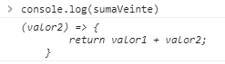
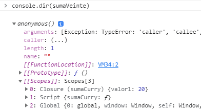

Sí, ya se, cuando te nombraron lo que llamamos Curry function
(o funciones currificadas
) te hizo ruido el estómago. Pero lamentablemente, nada tienen que ver con ese condimento. ¿Y por qué lleva el mismo nombre? Por Haskell
Curry, matemático estadounidense. Según Wikipedia
fue propuesto el nombre _Schönfinkelisation_
pero no creo que tenga tanto marketing.

## ¿Qué significa que una función sea currificada?

Una función currificada
es aquella que está compuesta por dos o más funciones, ejecutadas de forma secuencial. Estas funciones comparten los mismos argumentos ya que componen un mismo closure
.

### ¿Cómo se ve una función curry?

```javascript
//Función cotidiana
const suma = (valor1, valor2) => {
  return
  valor1 + valor2
}
suma(1, 2) // 3

//Función Curry
const sumaCurry = valor1 => {
  return
  valor2 => {
    return
    valor1 + valor2
  }
}
sumaCurry(4)(2) // 6
```

## ¿Qué notamos de diferente?

En el snippet
de código, podemos ver que la función curry recibe un parámetro (valor1), luego retorna una función que recibe el segundo parámetro (valor2) y esa función retorna la suma de ambos parámetros. Son dos funciones que comparten un mismo scope
y los mismos parámetros.

En el momento de ejecución de la función, tenemos que ejecutarla dos veces: una vez por cada función anidada hasta llegar al resultado. Esto nos permite desacoplar partes de la función y guardarlas en variables

## ¿En qué nos beneficia?

Una característica que a mí me encanta de las funciones curry es que nos permiten reutilizar funciones por partes. Por ejemplo, digamos que nuestra función `sumaCurry ` siempre la usamos para sumar de a 20. Podemos ejecutar la primera parte de la función, y guardar la segunda para más tarde

```javascript
const sumaVeinte = sumaCurry(20)

const sumaVeinte(10) // 30
```

Si nos fijamos en la consola con `console .log ` qué tiene dentro `sumaVeinte`
, nos mostrará esto:



Pero si utilizamos el método `console .dir` y nos dirigimos a donde dice `[[[Scopes ]]]` podremos ver dentro del closure
nuestro valor `20` guardado.



## Conclusión

La idea de este articulo era mostrarte la existencia de este tipo de funciones y puedas reconocerlas. Tienen muchos usos y se encuentran en muchos lenguajes de programación funcional. Te invito a que explores el concepto y lo pongas en práctica!
